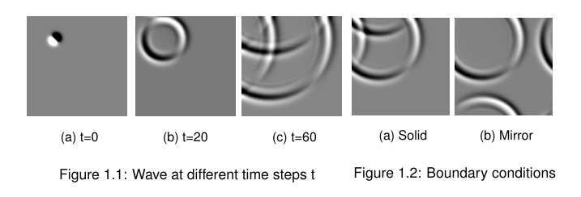

## About

Framework to train deep learning networks to predict wave propagation. The data are simulations from shallow water equations (also known as Saint-Venant equations). This was the thesis project for the MSc in Artificial Intelligence at the University of Edinburgh. The thesis itself can be found in the thesis folder.

This is how the dataset looks like.

In my project I trained 5 different architectures: LSTM, ConvLSTM, Causal LSTM (from PredRNN++),  Dilated ResNet-like, U-Net (CDNN). Here's some qualitative results for the prediction in the test set. As you can see the Causal LSTM and U-Net are pretty accurate.

Looking at the profile of intensities in the image we get a better understanding. Both models are good but U-Net is actually closer to the ground truth.

The quantitative results based on Mean Square Error(MSE) corroborate that U-Net (CDNN) is better than LSTMs for long term prediction in this problem. It actually generalizes better in other datasets too, have a look at the [thesis](thesis/thesis_final.pdf) if you are interested. 

## How to use

### Data and data generation

To faciliate the reproduction of my results you can download the same datasets I have used [here](https://imperialcollegelondon.box.com/s/hj1o82rwj8shlqekf2iyugo5u0ow50hz). 

You can also generate more data using the script in the `data_generation` folder.

`
python generate.py --location ./small_tank --container_size_mix 1 --container_size_max 2 --data_points 100
`

| Argument   | Type     | Default    | Description                                   |
| ------------------------ | -------- | ---------- | ------------------------------------------------------------ |
|location|str|'./debug_data_gen'|Folder to save the files|
|azimuth|int|45|Lighting angle|
|azimuth_random|bool|False|Lighting angle random|
|viewing_angle|int|20|Viewing angle|
|container_size_min|int|10|Minumum size of the water container|
|container_size_max|int|20|Maximum size of the water container|
|water_depth|int|10|
|initial_stimulus|int|1|Strength of initial stimuli|
|coriolis_force|float|0.0|Coriolis force coefficient|
|water_viscocity|int|1e-6|Water viscocity|
|total_time|float|1.0|Total sequence time in seconds|
|dt|float|0.01|Time interval between frames in seconds|
|image_size_x|int|184|Pixel size of the output images|
|image_size_y|int|184|Pixel size of the output images|
|data_points|int|500|How many sequences to create|

### Setup

Install the requirements with your package manager, i.e.  ` pip install -r requirements.txt`

In the `config.ini` fill in the data folder and the folder you want the experiments to be saved.

### Train

You can use the framework to train 5 different models: LSTM, ConvLSTM, Causal LSTM, Resnet-like and U-Net (CDNN). The full list of parameters can be found in the table below.

The following trains a U-Net with a specific weight decay coefficient:

`python train_network.py --experiment_name unet_wd_1e-5 --model_type --weight_decay_coefficient 1e-5 `

There are many available arguments.

| Argument                 | Type     | Default    | Description                                                  |
| ------------------------ | -------- | ---------- | ------------------------------------------------------------ |
| model_type               | str      | NA         | Network architecture for training [ar_lstm convlstm, resnet, unet, predrnn] |
| num_epochs               | int      | 50         | The experiment's epoch budget                                |
| num_input_frames         | int      | 5          | How many frames to insert initially                          |
| num_output_frames        | int      | 20         | How many framres to predict in the future                    |
| dataset                  | str      | 'original' | select which dataset to use [original, fixed_tub]             |
| batch_size               | int      | 16         | Batch size                                                   |
| samples_per_sequence     | int      | 10         | How may training points to generate from each simulation sequence |
| experiment_name          | str      | 'dummy'    | Experiment name - used for building the experiment folder    |
| normalizer_type          | str      | 'normal'   | how to normalize the images [normal, m1to1 (-1 to 1), none]  |
| num_workers              | int      | 8          | how many workers for the dataloader                          |
| seed                     | int      | 12345      | Seed to use for random number generator for experiment       |
| seed_everything          | str2bool | True       | Use seed for everything random (numpy, pytorch, python)      |
| debug                    | str2bool | False      | For debugging purposes                                       |
| weight_decay_coefficient | float    | 1e-05      | Weight decay to use for Adam                                 |
| learning_rate            | float    | 1e-04      | Learning rate to use for Adam                                |
| scheduler_patience       | int      | 7          | Epoch patience before reducing learning_rate                 |
| scheduler_factor         | float    | 0.1        | Factor to reduce learning_rated                              |
| continue_experiment      | str2bool | False      | Whether the experiment should continue from the last epoch   |
| back_and_forth           | bool     | False      | If training will be with predicting both future and past     |
| reinsert_frequency       | int      | 10         | LSTM: how often to use the reinsert mechanism                |

### Test

This is used to assess the generalization capabilities of a model. The test are run on all the datasets that are provided above. If you want to change that you'll need to change the dataloaders in the `evaluate_experiment` function in `utils/experiment_evaluatory.py`,

`python test_network.py --experiment_name unet_wd_1e-5`

Available arguments:

| Argument                 | Type     | Default    | Description                                                  |
| ------------------------ | -------- | ---------- | ------------------------------------------------------------ |
| test_starting_point      | int      | 15         | Which frame to start the test                                |
| num_total_output_frames  | int      | 80         | How many frames to predict to the future during evaluation   |
| get_sample_predictions   | str2bool | True       | Print sample predictions figures or not                      |
| num_output_keep_frames   | int      | 20         | How many frames to keep from each propagation in RNN models |
| refeed                   | str2bool | False      | Whether to use the refeed mechanism in RNNs                  |

## References

[Approximating the solution to wave propagation using deep neural networks](https://arxiv.org/pdf/1812.01609.pdf)
and [longer version](https://link.springer.com/chapter/10.1007/978-3-030-16841-4_26)

This master thesis: [Forecasting wave propagation with neural networks](https://github.com/stathius/wave_propagation/raw/master/thesis/thesis_final.pdf)
